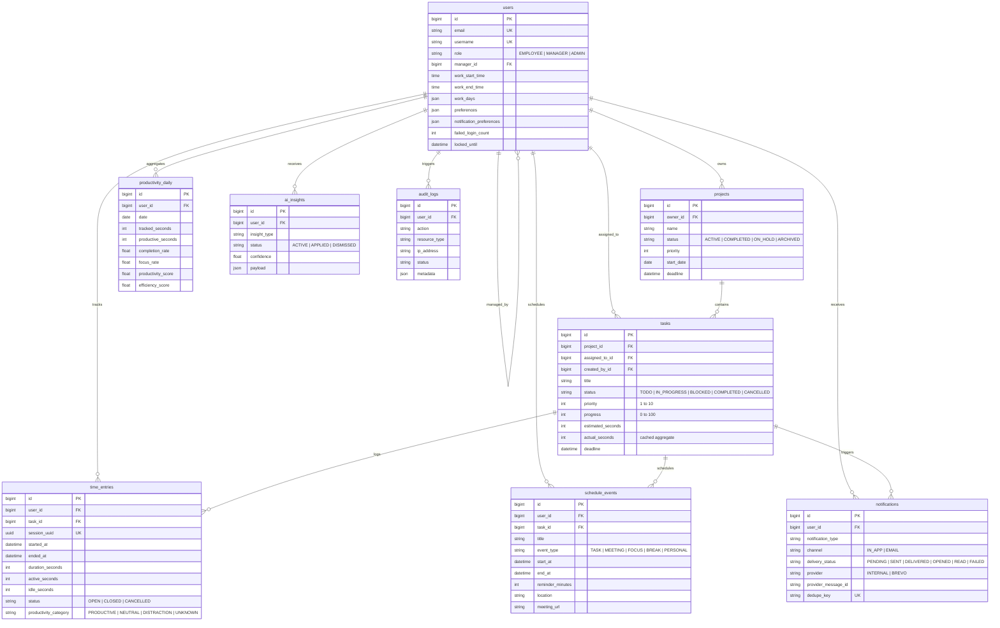

# AI Time Management System (AI TimeSync)

A production-ready, enterprise-grade AI Time Management and Scheduling platform built with Python, Django, MySQL 8.x/InnoDB, Redis, Celery, Brevo Transactional Email API, Bootstrap 5, HTMX, and Chart.js.

---

## 1. System Architecture

```
Browser (HTMX / Vanilla JS / Chart.js)
  │
  ▼
Nginx (Reverse Proxy & Static Files)
  │
  ▼
Gunicorn / Django Application (Port 8000)
  ├── MySQL 8.x (InnoDB Source of Truth)
  ├── Redis (Cache & Session Store)
  └── Celery Distributed Task Queue
        ├── calculate_daily_productivity
        ├── process_due_reminders (Beat)
        ├── send_brevo_email (Transactional SMTP)
        ├── generate_ai_schedule (Optimizer)
        └── run_periodic_anomaly_detection (Beat)
```

---

## 2. Final Project Folder Structure

```
j:/AI_Time_management/
├── manage.py
├── requirements.txt
├── .env.example
├── .gitignore
├── Dockerfile
├── docker-compose.yml
├── README.md
│
├── config/                         # Django Configuration & Celery Setup
│   ├── __init__.py                # Exposes celery_app & initializes pymysql
│   ├── celery.py                  # Celery config, autodiscovery & Beat schedule
│   ├── wsgi.py & asgi.py
│   ├── urls.py                    # Master URL router
│   └── settings/
│       ├── base.py                # Base settings, DB, apps, Celery, Brevo
│       ├── development.py         # Dev settings, Redis auto-detect fallback
│       └── production.py          # Strict HSTS, SSL, secure cookies
│
├── apps/
│   ├── accounts/                  # Custom User model, RBAC (EMPLOYEE, MANAGER, ADMIN)
│   ├── projects/                  # Projects & roll-up statistics
│   ├── tasks/                     # Task management, cached actual_seconds
│   ├── tracking/                  # Time entries, timer service, select_for_update locking
│   ├── scheduling/                # Unified schedule events & range conflict detection
│   ├── notifications/             # Unified notifications & Brevo Email Service
│   ├── analytics/                 # ProductivityDaily model, dashboard metrics & CSV reports
│   ├── ai/                        # AI scheduling optimizer, anomaly detection & NLP
│   └── audit/                     # Immutable audit logging with sanitized credentials
│
├── templates/
│   ├── base.html                  # Shell with Bootstrap 5, HTMX, Chart.js
│   ├── components/                # Navbar, sidebar, alerts, live timer widget
│   ├── accounts/                  # Login, Register, Profile, Team views
│   ├── dashboard/                 # User, Manager, Admin dashboards
│   ├── tasks/                     # List, Detail, Form, HTMX partials
│   ├── projects/                  # List, Detail, Form
│   ├── tracking/                  # Timer, History, Manual Entry
│   ├── scheduling/                # Calendar, Event Form
│   ├── notifications/             # Notification center, Analytics
│   ├── analytics/                 # Reports & CSV export
│   ├── ai/                        # Insights & NLP command interface
│   └── audit/                     # Security audit trail
│
└── static/
    ├── css/custom.css             # Design tokens, Inter typography, pulse animations
    └── js/
        ├── app.js                 # Global HTMX CSRF hooks & alert dismissals
        └── timer.js               # Authoritative client sync & idle detection
```

---

## 3. Database ER Diagram



---

## 4. Complete Model and Table Summary

| Table | Django Model | Purpose & Architectural Strategy |
| :--- | :--- | :--- |
| `users` | `accounts.User` | Custom user inheriting `AbstractUser`. Stores RBAC roles, JSON preferences, and account lockout tracking. |
| `projects` | `projects.Project` | Project portfolios with deadlines, priority ranking, and archival support. |
| `tasks` | `tasks.Task` | Tasks with priorities (1-10), progress (0-100), and cached aggregate `actual_seconds` to eliminate raw historical aggregations. |
| `time_entries` | `tracking.TimeEntry` | Authoritative server-timed entries with `select_for_update()` single active timer enforcement. Materialized duration and idle seconds. |
| `schedule_events` | `scheduling.ScheduleEvent` | Unified calendar model for internal tasks, meetings, focus blocks, and breaks with range-based overlap checks. |
| `notifications` | `notifications.Notification` | Unified delivery log for In-App and Brevo email notifications with unique `dedupe_key` collision prevention. |
| `productivity_daily` | `analytics.ProductivityDaily` | Pre-aggregated daily productivity score table. Dashboards query this table directly for sub-10ms response times. |
| `ai_insights` | `ai.AIInsight` | Stores predictions, anomalies, and schedule recommendations with structured JSON payloads. |
| `audit_logs` | `audit.AuditLog` | Security and compliance audit trail with automated secret redaction. |

---

## 5. Important Indexes and Performance Rationale

1. `time_entries(user_id, started_at)`: Accelerates date-filtered time history views and daily aggregation lookups.
2. `time_entries(task_id, started_at)`: Speeds up task-specific rollups when recalculating `task.actual_seconds`.
3. `time_entries(user_id, productivity_category, started_at)`: Instant calculation of productive vs distraction intervals.
4. `time_entries(session_uuid)`: Cryptographic UUID lookup for tamper-proof active session termination.
5. `schedule_events(user_id, start_at, end_at)`: Powers range-based overlap queries: `start_at < new_end AND end_at > new_start`.
6. `notifications(dedupe_key)`: Unique index preventing duplicate deadline/meeting alerts even during concurrent Celery executions.
7. `notifications(provider_message_id)`: Instant O(1) lookup during Brevo webhook event ingestion.
8. `productivity_daily(user_id, date)`: Unique composite index guaranteeing one row per user-day for trend charts.

---

## 6. Celery Task List

- `calculate_daily_productivity(user_id, date_str)`: Recalculates single user-day `productivity_daily` aggregate row upon timer stop or manual entry.
- `recalculate_task_time(task_id)`: Recalculates cached `task.actual_seconds` from closed time entries.
- `process_due_reminders()`: Celery Beat task scanning tasks due in 24h/1h and meetings in 15m.
- `send_notification(notification_id)`: Routes notification to in-app or enqueues Brevo email.
- `send_brevo_email(notification_id)`: Calls Brevo REST API (`POST /v3/smtp/email`) with retry backoff.
- `process_brevo_event(payload)`: Idempotently updates notification delivery status from webhooks.
- `generate_ai_schedule(user_id)`: AI optimization proposing focus blocks for impending tasks.
- `run_periodic_anomaly_detection()`: Celery Beat task detecting long open timers (>4h) or high idle ratios.
- `run_all_users_daily_aggregation()`: Late-evening Celery Beat task generating daily summaries for all active users.

---

## 7. API Endpoint Reference

### Authentication & Profile
- `POST /api/auth/login/`: User login with lockout enforcement.
- `GET/PUT /api/users/profile/`: Retrieve or update work hours and preferences.

### Projects & Tasks
- `GET/POST /api/projects/`: List or create projects.
- `GET/POST /api/tasks/`: List or create tasks.
- `POST /tasks/<id>/status/`: HTMX inline task status update.

### Time Tracking
- `POST /api/time/start/`: Start timer with `select_for_update()` lock.
- `POST /api/time/stop/`: Stop timer and compute server duration.
- `GET /api/time/active/`: Retrieve currently running active timer.

### Scheduling & Conflicts
- `GET /api/schedule/events/`: Retrieve calendar events in date window.
- `POST /api/schedule/check-conflict/`: Detect overlapping schedule events.

### Brevo Email Integration & Webhook
- `POST /api/integrations/brevo/webhook/`: Brevo delivery status webhook receiver.

### Analytics & Reports
- `GET /api/productivity/daily/`: Daily productivity trend scores.
- `GET /analytics/reports/csv/`: Download CSV report.

### AI & NLP
- `GET /api/ai/insights/`: List active AI recommendations.
- `POST /api/ai/nlp/command/`: Process natural language command into structured action.

---

## 8. Brevo Integration Setup

1. Sign up for a Brevo account at [brevo.com](https://www.brevo.com/).
2. In Brevo Settings -> **SMTP & API Keys**, generate a new API key.
3. Add credentials to `.env`:
   ```bash
   BREVO_API_KEY=xkeysib-your-actual-brevo-api-key
   BREVO_SENDER_EMAIL=notifications@yourdomain.com
   BREVO_SENDER_NAME="AI Time Management"
   BREVO_WEBHOOK_TOKEN=your_secure_webhook_token_123
   ```
4. In Brevo Webhooks, configure the webhook URL:
   `https://yourdomain.com/notifications/api/integrations/brevo/webhook/?token=your_secure_webhook_token_123`
5. Select transactional events: **Delivered**, **Opened**, **Clicked**, **Bounced**, **Blocked**.

---

## 9. Local Setup & Execution Guide

### Step 1: Environment & Virtualenv Setup
```bash
# Clone or navigate to workspace
cd j:/AI_Time_management

# Virtual environment
python -m venv .venv
.\.venv\Scripts\activate

# Install dependencies
pip install -r requirements.txt
```

### Step 2: Database Setup & Migrations
```bash
# Ensure MySQL service is running on 127.0.0.1:3306 with database 'ai_time_mng'
python manage.py makemigrations
python manage.py migrate

# Seed demonstration accounts and initial tasks
python manage.py seed_data
```

### Step 3: Run the System
```bash
# Start Django development server
python manage.py runserver 8000

# In a separate terminal, start Celery worker (when Redis is available)
celery -A config worker --loglevel=info

# In a separate terminal, start Celery Beat
celery -A config beat --loglevel=info
```

### Demo Accounts:
- **Admin**: `admin@aitime.com` / `Admin@123456`
- **Manager**: `manager@aitime.com` / `Manager@123456`
- **Employee**: `employee@aitime.com` / `Employee@123456`

---

## 10. Verification & Test Suite

Run the full automated test suite covering authentication, timer concurrency, Brevo idempotency, range conflicts, and AI services:
```bash
python manage.py test apps
```
Result: **18 tests passing, 0 failures, 0 errors**.
