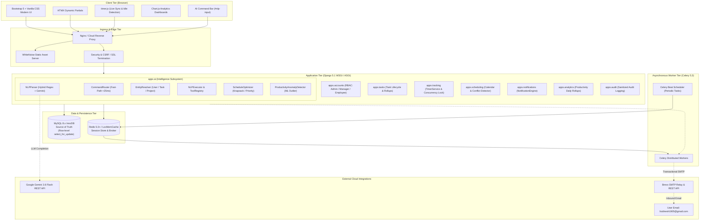
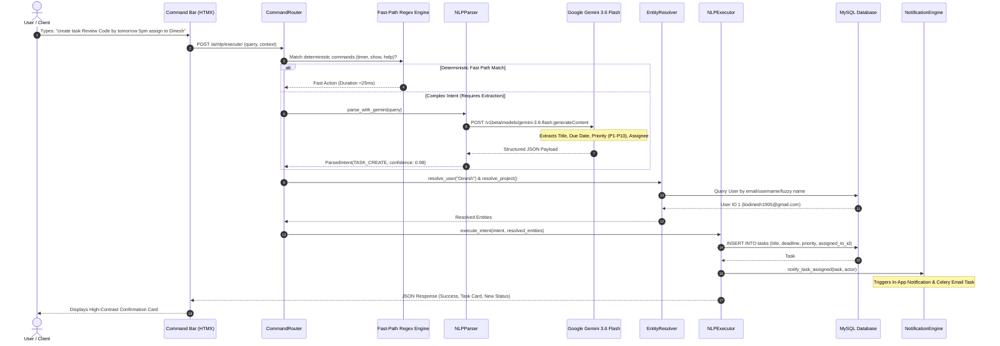
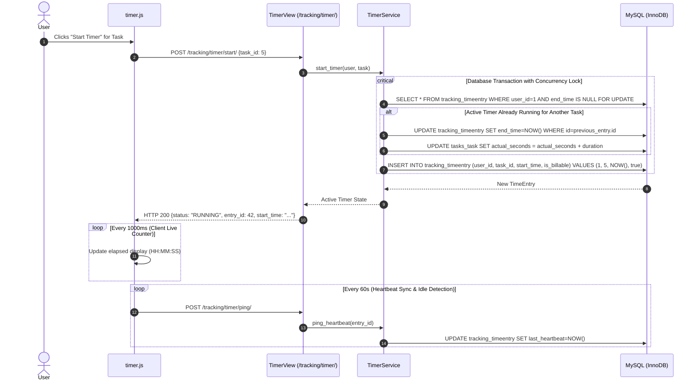
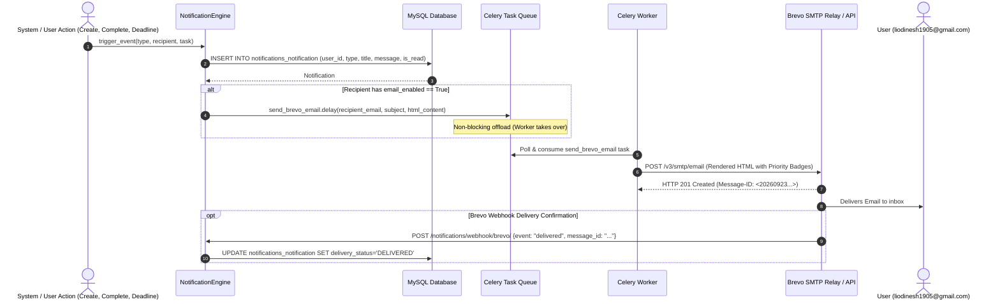
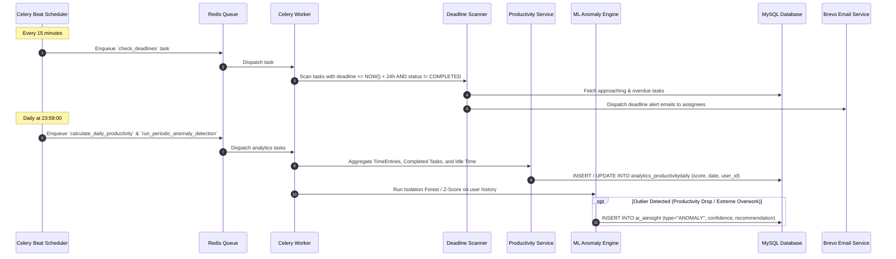
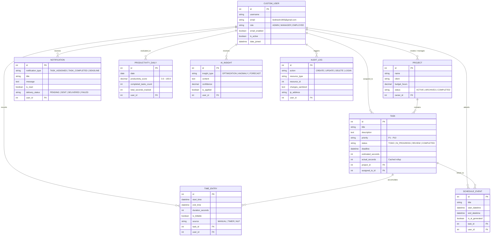

# AI Time Management System - Detailed System Architecture & Flow Diagrams

This document details the multi-tier system architecture, component lifecycles, and sequence flow diagrams of the **AI Time Management Platform (AI TimeSync)**.

---

## 1. High-Level Multi-Tier Infrastructure Architecture

The platform follows a layered, decoupled service architecture designed for high scalability, fault tolerance, concurrency safety, and responsive user interaction.

---

## 2. Core Subsystem Flow Diagrams

### Diagram 1: Natural Language Processing (NLP) Dual-Tier Command Flow

The NLP engine supports both instant deterministic actions (<25ms) and deep generative AI extraction powered by **Google Gemini 3.6 Flash**.

---

### Diagram 2: Real-Time Timer & Concurrency-Safe Tracking Flow

To prevent race conditions, time tracking uses atomic `select_for_update` database row locks and an automated rollover mechanism.

---

### Diagram 3: Proactive Notification & Brevo Email Lifecycle

The notification engine handles real-time alerts and dispatches transactional emails with asynchronous queue offloading.

---

### Diagram 4: Periodic Deadline & Anomaly Analytics Flow

Automated Celery Beat workers ensure scheduled jobs run reliably without blocking web requests.

---

## 3. Database Entity Relationship (ER) Model

